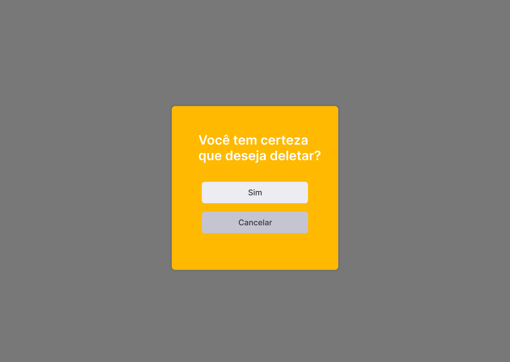

# Projeto Book Shelf

## Funcionalidades

### Autenticação do usuário

- Cadastro de usuário
- Login de usuário

### CRUD de livros

- Cadastro
- Edição
- Busca
- Listagem
- Remoção

## Estrutura do Projeto

O projeto Book Shelf é organizado em uma estrutura modular para facilitar o desenvolvimento, a manutenção e a escalabilidade. A pasta src serve como o núcleo do código-fonte, abrigando tanto a lógica do servidor (backend) quanto a interface do usuário (frontend).

### Pasta backend

A pasta backend é responsável por toda a lógica do servidor, incluindo a manipulação de dados, APIs e integrações com bancos de dados. Sua estrutura é organizada da seguinte forma:

- constants/: Armazena constantes globais que são usadas em diferentes partes do backend.
- db/: Responsável pela interação com o banco de dados. O frontend não interage diretamente com esta pasta.
- schemas/: Define os esquemas de dados e validações, onde o frontend pode ter acesso.
- services/: Contém a lógica de negócio e serviços específicos, onde o frontend pode ter acesso.
- tests/: Inclui testes automatizados para garantir a integridade e funcionalidade do código.

### Pasta frontend

A pasta frontend lida com a interface visual do sistema e a experiência do usuário. Ela é estruturada da seguinte maneira:

- assets/: Contém recursos estáticos, como imagens, ícones e fontes.
- components/: Armazena componentes reutilizáveis da interface.
- constants/: Define constantes globais utilizadas no frontend.
- pages/: Contém as páginas principais do sistema. Deve ser importada na main.
- utils/: Funções auxiliares e utilitárias.

### Telas da aplicação

#### Tela de Boas-vindas

A primeira tela que o usuário vê ao acessar o sistema. Existem dois botões, o "entrar" caso o usuario já possua um login cadastrado e o botão de registrar caso o usuário não tenha um login.

### Tela de Login

Permite que o usuário insira suas credenciais (e-mail e senha) para acessar o sistema.

Após informar os dados e clicar no botão "Continue", o usuário é direcionado para tela principal.

### Tela de Cadastro

Usada para criar uma nova conta no sistema, inserindo dados como nome, e-mail e senha.

Após informar os dados e clicar no botão "Cadastrar", aparece uma tela informando que o cadstro foi realizado com sucesso, caso todas as informações estejam todas corretas.

### Tela Principal

A interface central do sistema, exibe uma lista de livros cadastrados no sistema Book Shelf. Ela apresenta as seguintes funcionalidades:

- Cabeçalho: A barra superior amarela contém o logotipo "BOOK SHELF" e um ícone de logout no canto direito.
- Campo de Pesquisa: Uma barra de pesquisa permite que o usuário localize livros específicos na lista.
- Tabela de Livros:
  - Colunas: Título, Autor, Ano de Publicação, quantidade de paginas.

- Menu Lateral: O ícone de três linhas no canto esquerdo superior sugere a presença de um menu de navegação lateral. 
  - Tela com Menu Aberto: Exibe opções como "Cadastrar Livro", "Editar Livro" e "Deletar Livro", permitindo a navegação entre essas funcionalidades.
  

### Tela de Cadastrar Livro

Permite a inserção de informações sobre um novo livro, como título, autor, ano de publicação, e quantidade de paginas.

Com todas as informações preenchidas e ao clicar o botão de "Cadastras livro", aparecerá uma tela informando que o livro foi cadastro com sucesso.

### Tela de Editar ou Deletar Livro

Oferece a opção de editar os dados ou excluir o livro do sistema. Nela terá a tabela dos livros com duas nomas informações na tabela, o deita e deletar.

- Tabela de Livros:
  - Colunas: Título, Autor, Ano de Publicação, quantidade de paginas, Editar e Deletar.
  - Ícone de Edição: O ícone de lápis permite editar as informações do livro.
  - Ícone de Lixeira: O ícone de lixeira permite excluir o livro da lista.

#### Tela de Editar Dados do Livro

Essa tela de Editar Dados do Livro, aparece quando é clicado no ícone de lápis que permite a modificação de informações de um livro já cadastrado.

Com todas as informações preenchidas e editada, ao clicar no botão de "Editar livro", aparecerá uma tela informando que o livro foi editado com sucesso.

#### Tela de deletar livro

Quando clicar no ícone de lixeira que permite excluir o livro da lista, aparece uma tela com opções para saber se o usuário deseja realmente excluir o livro.

Depois de aparecer a tela de opções de deletar e se o usuário clicar no botão de "Sim", aparecerá uma tela informando que o livro foi deletado com sucesso.

## Acesso ao banco de dados

O acesso ao banco de dados do Firebase é controlado por credenciais de serviço específicas. Para garantir a segurança do sistema, somente usuários autorizados que possuam as credenciais adequadas podem acessar os dados.

As credenciais de serviço contêm as chaves privadas necessárias para autenticação com os serviços do Firebase, incluindo o banco de dados. Para evitar acessos não autorizados, é fundamental que as credenciais sejam mantidas em segurança e somente os donos do sistema ou administradores devidamente autorizados tenham acesso a elas.

[figma](https://www.figma.com/design/xrLJrHbZujpruzcU3WVu6Q/Biblioteca-de-livro?node-id=0-1&t=uGWfxSLcHEIC9Gh8-1)
